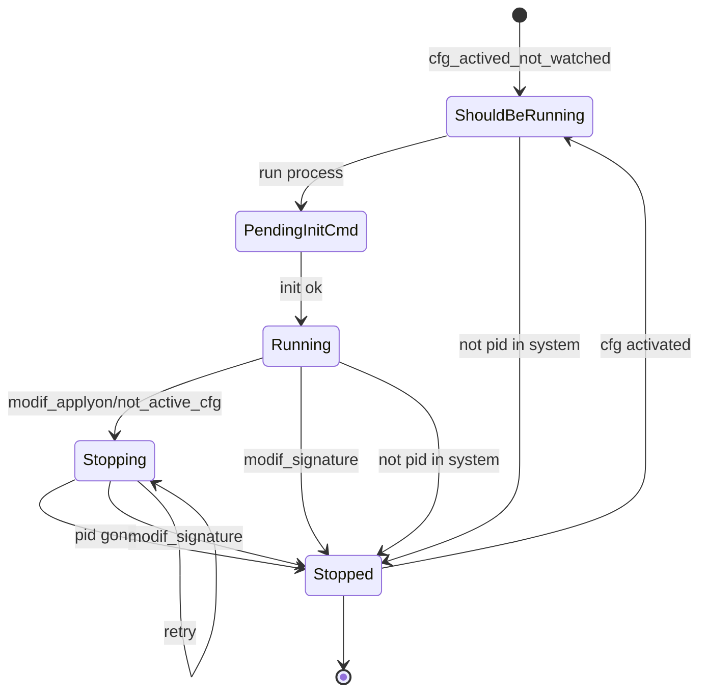
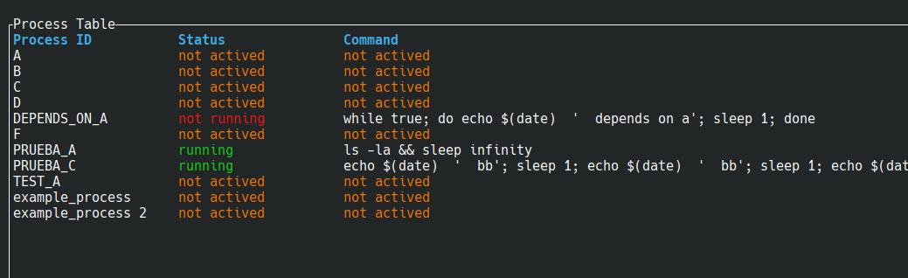
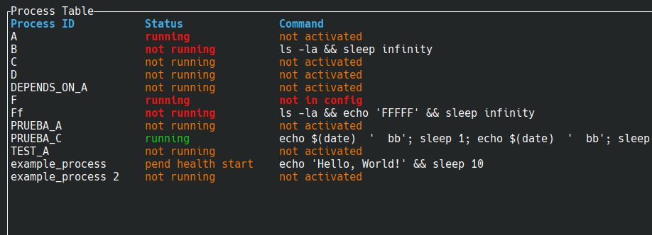

# PROCMAN


## TODO


* la configuración se tiene que leer en main y pasar a los dos módulos
* comandos oneshot
* comando before opcional
* hay que borrar los procesos que tengan running_status pero no estén en config
    * proc_info.process_watched = None
    * en realidad tienen  que estar en stopped hace más de 2h sin que estén en config activos
* fn run_command_with_timeout(command: &str, timeout: time::Duration) -> Result<(), String> {
    * compartir
* configuración tiempo entre rearranques
* ¿añadir un comando force_stop?
* cli 
    * commands
        * stop
        * ...
* add process type oneshot
* revisar varios ficheros en paralelo (no en tui)


* probar supervisor
* eliminar los println! y eprintln! centralizar (afecta al tui)
* renonbrar los running por watched
* log con tiempo ejecución oneshot
* tui
    * estructura con estado completo para renderizar
    * filter processes
    * detect if managing/monitoring is stopped
    * show full config for process
    * show depen_on and depend_from processes and navigate to them
* ajustar el tiempo de chequeo
* revisar la visiblidad de módulos pub(crate) pub(super)
* groups?
* add external_depend_cmd
* logs
* commands arguments
    * debug
    * ...
* detect zombie processes
* run-once
* execution retries
    * specify frequency and possibly the number of attempts
* rename running for watched when pertinent
    * running_status
    * RUNNING_STATUS_FOLDER
    * running.status
* tipo daemon


## Description

The goal is to create a simple and secure tool to schedule and manage the startup of multiple services/processes on a machine.

It will work with a text file (currently a TOML configuration) for management.

It is declarative; the system will adjust the service configuration to match the document.

Although it may seem like a supervisor, it has some of the characteristics but intentionally lacks others.

It is not intended to replace mature and high-quality tools like systemd, supervisord, Kubernetes...

It must be a small, lightweight, and non-critical program.

It is not designed to start many services very quickly or work with a cluster.

It will not attempt to start many services simultaneously in parallel, as this could cause bottlenecks in already running services.

If this program stops (due to an error, failure, or intentionally), it should not stop all "managed" services.

Once restarted, it should continue monitoring and managing.

### AIMS

* Start and stop processes
* Declarative and simple  
* No duplicate services  
* Start at the right time  
* The supervision process should not be critical  
* It should not be easy to stop services due to failure or confusion  


## Examples of service configurations

The configuration will start with an identifier for the services to be managed and the configuration file format.

```toml
uid = "550e8400-e29b-41d4-a716-446655440000"
file_format = "0"
```

The identifier can be generated by passing `uid` as a parameter to the program.

### Example of a process configuration 1

```toml
[[process]]
id = "example_process"
command = "echo 'Hello, World!' && sleep 10"
apply_on = "2024-10-01T12:00:00"
type = "normal"                              # optional  normal/fake/one-shot

[process.schedule]
start_time = "00:00:00"                  # optional
stop_time = "23:59:00"                   # optional
week_days = ["mon", "wed", "thu", "sun"] # optional
# week_days = "mon-fri"   # also valid
# week_days = "all"   # also valid

[process.init] # optional
command = "sleep 1"
timeout = "3s"  # optional

[process.before] # optional
command = "sleep 1"
timeout = "3s"  # optional

[process.health_check] # optional
command = "sleep 1"
timeout = "3s"  # optional
```

### Example of a process configuration 2

```toml
[[process]]
id = "example_process 2"
command = "echo 'Starting process...'"
apply_on = "2029-10-01T12:00:00"
init = { command = "sleep 1", timeout = "3s" }
before = { command = "sleep 1", timeout = "3s" }
health_check = { command = "curl -I http://localhost:8080", timeout = "3s" }
schedule = { start_time = "08:00:00", stop_time = "18:00:00", week_days = [
    "mon",
    "tue",
    "wed",
    "thu",
    "fri",
] }
type = "normal"
depends_on = ["example_process"]
```

#### process.id

Name to identify the process in logs, TUI, and dependencies

#### process.command

Command to be executed and monitored by the system

#### process.apply_on

From what moment the command should be executed

Useful for scheduling future services, stopping in the future, updates, and rollbacks

#### process.type

`normal` is the default value.

`fake` disables the process, valid for debugging and testing, but not recommended for production.

`one-shot` This option does not relaunch the process if it stops before its scheduled interval. In fact, the expected behavior is for it to stop earlier.

This is useful for one-time tasks that execute once and terminate when finished. For example, cleanup tasks, log rotation, etc.


#### process.schedule.start_time / stop_time

The process will be running during this time interval

#### process.schedule.week_days

To define which days of the week it applies

#### process.init

Once the process is running, it may be necessary to execute some initialization commands

The process will not be marked as "running" until this command has successfully finished

It will attempt once, and in case of failure, it will transition to the `Stopping` state, initiating the stop procedure.

```toml
[[process]]
id = "example_process 2"
command = "echo 'Starting process...'"
apply_on = "2029-10-01T12:00:00"
init = { command = "sleep 1", timeout = "3s" }
```


#### process.before

Aquí se puede poner un comando a ejecutar antes que el comando de este proceso

Si la ejecución de before tiene éxito, continuará con los pasos para ejecutar este proceso

Si la ejecución de before falla, pasará a stopped y se reintentará más tarde

```toml
[[process]]
id = "example_process 2"
command = "echo 'Starting process...'"
apply_on = "2029-10-01T12:00:00"
before = { command = "sleep 1", timeout = "3s" }
```


### Change only the command...

If only the command line is changed, the system will not restart the service (this is intentional).

In fact, only when effective apply_on is modified, the process will be restarted

It is not good practice to change only the command line, and restarting the service is a delicate operation.


### Schedule a future new version

Suppose we want to apply a change to service A for startup tomorrow

```toml
# current version running
[[process]]
id = "SERVICE_A"
command = "echo $(date)  '  bb'"
apply_on = "2023-10-01T08:00:00"

# next version to run
[[process]]
id = "SERVICE_A"
command = "echo $(date)  '  bb'; sleep 1; echo $(date)  '  bb'; sleep 1; echo $(date)  '  bb'; sleep 1"
apply_on = "2025-04-01T08:00:00"
```

We see that the service is defined twice.

One configuration started applying in October 2023.

The next configuration will apply on April 1, 2025, at 8:00 AM.

Since it has no start and stop time, it is a 24x7 service.

On April 1, 2025, at 8:00 AM, the first configuration will stop, and once the stop is confirmed, the second option for `SERVICE_A` will execute.

### Rollback

To perform a rollback, we can mark the new version as `fake`

```toml
# current version running
[[process]]
id = "SERVICE_A"
command = "echo $(date)  '  bb'"
apply_on = "2023-10-01T08:00:00"

# next version to run
[[process]]
type = "fake"
id = "SERVICE_A"
command = "echo $(date)  '  bb'; sleep 1; echo $(date)  '  bb'; sleep 1; echo $(date)  '  bb'; sleep 1"
apply_on = "2025-04-01T08:00:00"
```

### Dependencies

The process `DEPENDS_ON_A` will not run until the process `TEST_A` is in the running state.

```toml
[[process]]
id = "TEST_A"
command = "while true; do echo $(date)  '  test a'; sleep 1; done"
apply_on = "2024-11-01T12:20:00"

[[process]]
id = "DEPENDS_ON_A"
command = "while true; do echo $(date)  '  depends on a'; sleep 1; done"
apply_on = "2024-10-01T12:20:00"
depends_on = ["TEST_A"]
```

Circular references (and self references a a specific case) will be detected on check

Also it will check horphan references


## Not working with system PID

#### process.stop

Here you can choose whether to send a specific command to stop the process.

If not specified, a `SIGTERM` will be sent, and if the process does not stop after several retries, a `SIGKILL` will be sent.

You can optionally specify the timeout for executing this command.

Examples:

```toml
[[process]]
id = "A"
command = "echo 'hi' && sleep 99999"
apply_on = "2029-11-01T12:00:00"
stop = "sleep 1"
```

```toml
[[process]]
id = "A"
command = "echo 'hi' && sleep 99999"
apply_on = "2029-11-01T12:00:00"
stop = {command = "sleep 5", timeout = "1s"}
```

The safest approach is to work with the `pid`, but in some cases, this may not be possible.

In such cases, the stop command can be used.


#### process.health_check

When it is not possible to work with the system PID to verify if the process is alive, we can execute a command that will succeed if the process is alive and fail otherwise.

Configuration examples:

```toml
[[process]]
id = "A"
command = "echo 'hi' && sleep 99999"
apply_on = "2029-11-01T12:00:00"
stop = "sleep 1"
health_check = "command"
```

```toml
[[process]]
id = "A"
command = "echo 'hi' && sleep 99999"
apply_on = "2029-11-01T12:00:00"
stop = {command = "sleep 5", timeout = "1s"}
health_check = {command = "command", timeout = "1s"}
```


It is crucial that the command performs its task correctly.

If it is queried and returns "ok" when the process is not alive, it will leave it stuck in the `stopping` state.


## Running podman detached

Perhaps it is better to use a specific template.

This option may be removed in the future.

Podman can run in `detached` mode and without a `root-daemon`.

This introduces some challenges for supervision.

For this case, there is an option:

`process.type = "podman_cid"`

This means it will expect a `podman run -d` (aka podman run detached) which will immediately return the `cid`, and from that `cid` the `pid` will be obtained to supervise the process.

```toml
[[process]]
id = "example_process podman detached"
command = "podman run -d --replace --rm --name test incubator_tini sleep 1122"
apply_on = "2024-10-01T12:00:00"
type = "podman_cid"
```

> **IMPORTANT!**  
> It is highly recommended to always use containers with `--init`


## PODMAN


Working with Podman in this "disconnected" supervision is delicate.

One option to simplify would be to work at the container level instead of the `pid` level.

For this system, one of the priorities is to ensure that services will start when needed.

A running container, in the event of a "sudden" machine shutdown, could end up in a state that poorly responds to startup requests, such as `Created`.

In the `Created` state, it will not respond to `run` or `--replace`, for example.

To ensure the system starts, one option would be to execute:

```txt
podman stop -t4 test || true && podman rm -f test
```

It is also highly recommended to specify that containers must work with ```--init```.

Not working with `pid` would require...

```toml
health_check = "[ \"$(podman inspect --format '{{ '{{.State.Status}}' }}' test)\" = \"running\" ]"
stop = "podman stop -t4 test || true && podman rm -f test"
```

We would end up with something like this...

```toml
command = "podman run --init --rm --name test  docker.io/ubuntu:24.04  sleep 444"
before = "podman stop -t4 test || true && podman rm -f test"
health_check = "[ \"$(podman inspect --format '{{ '{{.State.Status}}' }}' test)\" = \"running\" ]"
stop = "podman stop -t4 test || true && podman rm -f test"
```

This is a very safe configuration for working with a container:


## Templates

Many services may follow a common pattern.

Repeating it is inconvenient and obscures the configuration.

One option is to create a specific `kind`.

This option is ideal unless you require changes or a new context arises.

In both cases, it would be necessary to recompile and update this program.

Using templates would allow removing redundancies but at the cost of worsening error messages.

Templates should not be overused.

A use case is working with `podman`, as seen in the previous section.

Repeating the following configuration many times makes the configuration file difficult to read:

```toml
command = "podman run --init --rm --name test  docker.io/ubuntu:24.04  sleep 444"
before = "podman stop -t4 test || true && podman rm -f test"
health_check = "[ \"$(podman inspect --format '{{ '{{.State.Status}}' }}' test)\" = \"running\" ]"
stop = "podman stop -t4 test || true && podman rm -f test"
```

A template could be defined as follows:

```toml
[[template]]
name = "PODMAN"
template = '''
command = "podman run --init --rm --name {{ container_name }} {{ image }} {{ command }}"
before = "podman stop -t4 {{ container_name }} || true && podman rm -f {{ container_name }}"
health_check = "[ \"$(podman inspect --format '{{ '{{.State.Status}}' }}' {{ container_name }})\" = \"running\" ]"
stop = "podman stop -t4 {{ container_name }} || true && podman rm -f {{ container_name }}"
'''
```

And the service configuration would be simplified to:


```toml
[[process]]
id = "A"
apply_on = "2029-11-01T12:00:00"

[process.template]
template = "PODMAN"
container_name = "test_a"
image = "docker.io/ubuntu:24.04"
command = "sleep 444"


[[process]]
id = "B"
apply_on = "2029-11-01T12:00:00"

[process.template]
template = "PODMAN"
container_name = "test_b"
image = "docker.io/ubuntu:24.04"
command = "sleep 555"

```

To debug, there is a `cli` command to expand the templates. 

```
expand-templates  Expand config templates and show on stdout
```


## Watched ProcessStatus




## TUI

Work in progress



The interface is independent from process management and supervision.

The TUI will contrast the information from the configuration file with the information about the running processes.

It will display the status, highlighting differences in red in the Status column.

The TUI can be launched without procman actively monitoring or supervising the processes, what probably will produce inconsistencies

Here an example



As you can see, there are processes in an error state (red color). Some are running when they shouldn’t be, while others are not running despite being expected to be active.

These inconsistencies are detected by comparing the actual state of the processes with the expected by configuration, and are highlighted in the interface.

