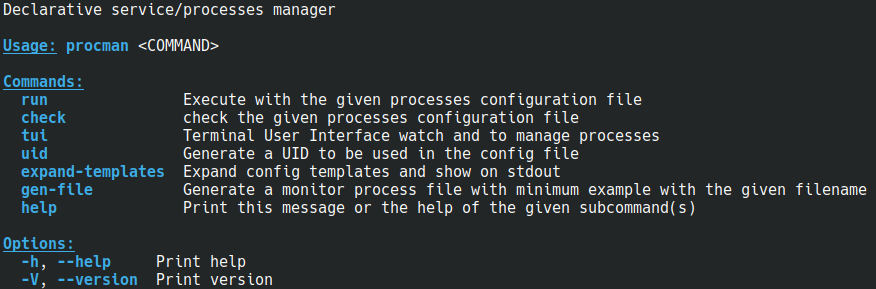
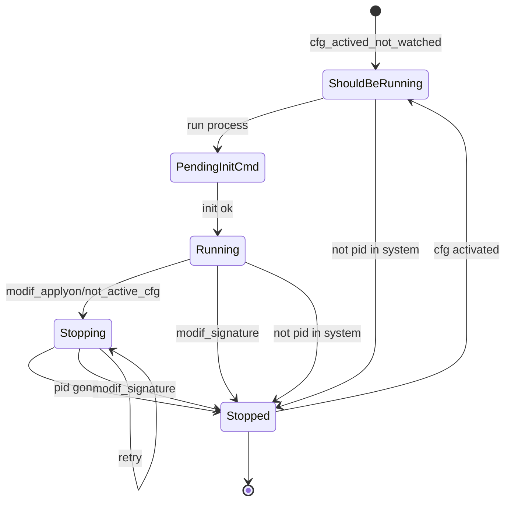

# PROCMAN


## TODO


* muestra en rojo stopped para un proceso one-shot que está "bien" terminado, corregir
* log en sqlite, comando para consultar, añadir a tui


* En la línea de comando, reemplazar {{ VAR }} parámetros procman del servicio, y si no lo hay buscar en variables de entorno
* tui mostrar la úlitma actualización de procesos, si es muy antigua, en rojo
* delete old files, delete old stopped
* hay que borrar los procesos que tengan running_status pero no estén en config
    * proc_info.process_watched = None
    * en realidad tienen  que estar en stopped hace más de 2h sin que estén en config activos

* configuración tiempo entre rearranques
* errores importantes con "!"
* envío de email para errores importantes?
* fn run_command_with_timeout(command: &str, timeout: time::Duration) -> Result<(), String> {
    * compartir
* ¿añadir un comando force_stop?
* cli 
    * commands
        * stop
        * ...
* comandos (parada completa, desbloqueo proceso...)
¿alguna forma de desbloquear un proceso?
Por ejemplo, un waitting pid file?
quizá desde el tui


* probar supervisor
* eliminar los println! y eprintln! centralizar (afecta al tui)
* log con tiempo ejecución oneshot
* tui
    * estructura con estado completo para renderizar
    * filter processes
    * detect if managing/monitoring is stopped
    * show full config for process
    * show depen_on and depend_from processes and navigate to them
* ajustar el tiempo de chequeo
* revisar la visiblidad de módulos pub(crate) pub(super)
* groups?
* add external_depend_cmd
* logs
* commands arguments
    * debug
    * ...
* detect zombie processes
* run-once
* execution retries
    * specify frequency and possibly the number of attempts
* rename running for watched when pertinent
    * running_status
    * RUNNING_STATUS_FOLDER
    * running.status
* tipo daemon


## Description

The goal is to create a simple and secure tool to schedule and manage the startup of multiple services/processes on a machine.

It will work with a text file (currently a TOML configuration) for management.

It is declarative; the system will adjust the service configuration to match the document.

Although it may seem like a supervisor, it has some of the characteristics but intentionally lacks others.

It is not intended to replace mature and high-quality tools like systemd, supervisord, Kubernetes...

It must be a small, lightweight, and non-critical program.

It is not designed to start many services very quickly or work with a cluster.

It will not attempt to start many services simultaneously in parallel, as this could cause bottlenecks in already running services.

If this program stops (due to an error, failure, or intentionally), it should not stop all "managed" services.

Once restarted, it should continue monitoring and managing.

### AIMS

* Start and stop processes
* Declarative and simple  
* No duplicate services  
* Start at the right time  
* The supervision process should not be critical  
* It should not be easy to stop services due to failure or confusion  


## Modifs

| Version | Changes                         |
| ------- | ------------------------------- |
| 0.1.6   | Removed minijinja               |
|         | Added back kebab-case on config |
| 0.1.5   | Removed kebab-case              |
         

## Commands




## Command.gen-file

This will generate a simple base file for process management

Something similar to...

```toml
# This is a simple process configuration file for procman
# It contains a single process with a simple command
uid = "fa7c0a0a-dd03-4b99-8068-aae52bb65938"
file-format = "0"

[[process]]
id = "example_process"
apply-on = "2025-05-12T21:00:00"
command = "sleep 5555"

#optionals  -----------------------------------------
fake = false
depends-on = []
work-dir = "/tmp"
before = "echo 'Preparing to start process...'"
init = "echo 'Process is starting...'"
stop = "echo 'Stopping process...'"

[process.schedule]
start-time = "00:00:00"
stop-time = "23:59:00"
week-days = ["mon", "wed", "thu", "sun"]


# ---


[[process]]
id = "example_process 2"
apply-on = "2023-10-01T12:00:00"
command = "echo 'Hello, World!'"
```

Here we have two processes to manage


## TUI

Work in progress


The interface is independent from process management and supervision.

The TUI will contrast the information from the configuration file with the information about the running processes.

It will display the status, highlighting differences in red in the Status column.

The TUI can be launched without procman actively monitoring or supervising the processes, what probably will produce inconsistencies

Here an example


As you can see, there are processes in an error state (red color). Some are running when they shouldn't be, while others are not running despite being expected to be active.

These inconsistencies are detected by comparing the actual state of the processes with the expected by configuration, and are highlighted in the interface.


## File Configuration

The file format is `toml`

There is documentation on the internet about this format, but it is quite simple and with the examples shown here it is not necessary to read specific documentation about this format


```toml
uid = "fa7c0a0a-dd03-4b99-8068-aae52bb65938"
```

Each file must have a different uid

This can be generated with the `uid` command

The `gen-file` command will write a valid uid


```toml
file-format = "0"
```

Indicates the file format version


## Basic Process Configuration

```toml
[[process]]
```

Process configuration start indicator


```toml
id = "example_process"
```


Process identifier

It will be used in logs, `tui` and references between processes (for example startup dependencies will also use this identifier)


```toml
apply-on = "2023-10-01T12:00:00"
```

When the configuration of this process should start being applied

An `id` can be repeated with different `apply-on`


```toml
command = "echo 'Hello, World!'"
```

The command and parameters to launch the process


```toml
depends-on = []
```

Used to indicate the list of processes it depends on

This process will not start until the `id` of the indicated processes are in `running` state

Dependent processes will stop if one of the processes they depend on stops being in `running` state


```toml
work-dir = "/tmp"
```

The command will be launched in the indicated directory


```toml
before = "echo 'Preparing to start process...'"
```

This command will be executed before the process command

If the command fails, it will not continue, and the retry will start again with `before`


```toml
init = "echo 'Process is starting...'"
```

The process has been launched, is running, and now this initialization command will be executed

If the command fails, the process will stop and be retried

```toml
stop = "echo 'Stopping process...'"
```

Command to stop the process

By default a `SIGTERM` will be sent and if after several retries it still doesn't stop, a `SIGKILL` will be sent


```toml
[process.schedule]
start-time = "00:00:00"
stop-time = "23:59:00"
week-days = ["mon", "wed", "thu", "sun"]
```

Allows us to indicate the process execution schedule

It must be running during the indicated schedule, except for `one-shot` processes


## Examples of service configurations

The configuration will start with an identifier for the services to be managed and the configuration file format.

```toml
uid = "550e8400-e29b-41d4-a716-446655440000"
file-format = "0"
```

The identifier can be generated by passing `uid` as a parameter to the program.

### Example of a process configuration 1

```toml
[[process]]
id = "example_process"
work-dir = "/tmp"
command = "echo 'Hello, World!' && sleep 10"
apply-on = "2024-10-01T12:00:00"

[process.schedule]
start-time = "00:00:00"                  # optional
stop-time = "23:59:00"                   # optional
week-days = ["mon", "wed", "thu", "sun"] # optional
# week-days = "mon-fri"   # also valid
# week-days = "all"   # also valid

[process.init] # optional
command = "sleep 1"
timeout = "3s"  # optional

[process.before] # optional
command = "sleep 1"
timeout = "3s"  # optional

[process.health-check] # optional
command = "sleep 1"
timeout = "3s"  # optional
```

### Example of a process configuration 2

```toml
[[process]]
id = "example_process 2"
command = { line = "echo 'Starting process...'", type = "normal" }
apply-on = "2029-10-01T12:00:00"
init = { command = "sleep 1", timeout = "3s" }
before = { command = "sleep 1", timeout = "3s" }
health-check = { command = "curl -I http://localhost:8080", timeout = "3s" }
schedule = { start-time = "08:00:00", stop-time = "18:00:00", week-days = [
    "mon",
    "tue",
    "wed",
    "thu",
    "fri",
] }
depends-on = ["example_process"]
```


## Additional Process Parameters

```toml
fake = true
```

We indicate that this process configuration is fake and should not be considered

```toml
one-shot = true
```

These processes don't have to be running permanently

"Normal" processes, if they stop, will be restarted, `one-shot` processes won't

These processes cannot continue execution outside the established schedule. If the process is still running when its schedule ends, the stop process will be initiated

```toml
init = { command = "sleep 1", timeout = "3s" }
```

This option does not relaunch the process if it stops before its scheduled interval. In fact, the expected behavior is for it to stop earlier.

This is useful for one-time tasks that execute once and terminate when finished. For example, cleanup tasks, log rotation, etc.

Once the process is running, it may be necessary to execute some initialization commands

The process will not be marked as "running" until this command has successfully finished

It will attempt once, and in case of failure, it will transition to the `Stopping` state, initiating the stop procedure.


```toml
before = { command = "sleep 1", timeout = "3s" }
```

Here you can put a command to execute before this process command

If the execution of before is successful, it will continue with the steps to execute this process

If the execution of before fails, it will go to stopped and be retried later


```toml
stop = "sleep 1"
```

Here you can choose whether to send a specific command to stop the process.

If not specified, a `SIGTERM` will be sent, and if the process does not stop after several retries, a `SIGKILL` will be sent.

You can optionally specify the timeout for executing this command.

```toml
stop = {command = "sleep 5", timeout = "1s"}
```


The safest approach is to work with the `pid`, but in some cases, this may not be possible.

In such cases, the stop command can be used.


## Command

The standard configuration is...

```toml
command = "sleep 5555"
```

This will execute the command with the selected parameters

The `pid` of the process will be recorded to monitor that it doesn't stop prematurely

In case of a stop, it will be restarted

If the stop time arrives and the process is still running, the system will stop it with a `SIGTERM` signal, and if after several retries it doesn't stop, a `SIGKILL` signal will be sent


If we want the command to be a shell expression and not just a program with parameters, we'll indicate it with...

```toml
command = { line = "echo hi &&  &&  sleep 2  && echo hi2  &&  sleep 555", type = "expression" }
```

> DANGER! This can compromise the `pid` management of process lifetime. See process lifetime management for more detail


## Change only the command...

If only the command line is changed, the system will not restart the service (this is intentional).

In fact, only when effective apply-on is modified, the process will be restarted

It is not good practice to change only the command line, and restarting the service is a delicate operation.


## Schedule


The process will be running during this start-time / stop-time interval


To define which days of the week it applies

```toml
[process.schedule]
start-time = "00:00:00"                  # optional
stop-time = "23:59:00"                   # optional
week-days = ["mon", "wed", "thu", "sun"] # optional
# week-days = "mon-fri"   # also valid
# week-days = "all"   # also valid
```


### Schedule a future new version

Suppose we want to apply a change to service A for startup tomorrow

```toml
# current version running
[[process]]
id = "SERVICE_A"
command = "echo $(date)  '  bb'"
apply-on = "2023-10-01T08:00:00"

# next version to run
[[process]]
id = "SERVICE_A"
command = "echo $(date)  '  bb'; sleep 1; echo $(date)  '  bb'; sleep 1; echo $(date)  '  bb'; sleep 1"
apply-on = "2025-04-01T08:00:00"
```

We see that the service is defined twice.

One configuration started applying in October 2023.

The next configuration will apply on April 1, 2025, at 8:00 AM.

Since it has no start and stop time, it is a 24x7 service.

On April 1, 2025, at 8:00 AM, the first configuration will stop, and once the stop is confirmed, the second option for `SERVICE_A` will execute.

### Rollback

To perform a rollback, we can mark the new version as `fake`

```toml
# current version running
[[process]]
id = "SERVICE_A"
command = "echo $(date)  '  bb'"
apply-on = "2023-10-01T08:00:00"

# next version to run
[[process]]
fake = true
id = "SERVICE_A"
command = "echo $(date)  '  bb'; sleep 1; echo $(date)  '  bb'; sleep 1; echo $(date)  '  bb'; sleep 1"
apply-on = "2025-04-01T08:00:00"
```


### Dependencies

The process `depends-on_A` will not run until the process `TEST_A` is in the running state.

```toml
[[process]]
id = "TEST_A"
command = "while true; do echo $(date)  '  test a'; sleep 1; done"
apply-on = "2024-11-01T12:20:00"

[[process]]
id = "depends-on_A"
command = "while true; do echo $(date)  '  depends on a'; sleep 1; done"
apply-on = "2024-10-01T12:20:00"
depends-on = ["TEST_A"]
```

Circular references (and self references a a specific case) will be detected on check

Also it will check horphan references


## Process Lifetime Management

By default, in simple commands (which are programs with parameters) the system `pid` obtained when launching the process will be used to monitor that it continues to work, or stop it when necessary

In some cases, `shell` expressions may be required

```toml
command = { line = "echo hi &&   sleep 333 ;  echo  end", type = "expression" }
```

The problem is that this can generate multiple processes depending on the running system, and lifetime and signal management will also depend on the system

Additionally `kill -9` on one of the processes in an expression will not necessarily be propagated to other processes

Some processes can also launch multiple processes, and the target process might not be the process whose `pid` is captured

For these situations there are several options

Use a combination of parameters

```toml
init = "..."
health-check = "..."
stop = "..."
```

`health-check` can receive a command with timeout

You can verify if a socket is operational, or if a lock file has been created... the command will depend on the context

Optionally, `health-check` can be given a directory to monitor for file activity

```toml
health-check = { folder = "./fake", inactive-time = "10s" }
```
The option to monitor a directory is very interesting because if the process gets blocked, the `pid` will still be alive, but without activity, the system will restart it

> DANGER! If the process takes a long time to start, and the `health-check` is queried before it's operational, the system will consider it as non-operational and mark the process as stopped. THIS COULD CAUSE DUPLICATE STARTS

To avoid duplicate starts due to concurrency issues, in `init` it's advisable to ensure using a safe command to stop the process/service


There is the possibility of using a `shell` expression where we can inform `procman` of the target pid to monitor/manage

```toml
command = { line = "echo hi &&  echo {{ PROCMAN_PID_FILE }}  &&  sleep 2  && (sleep 333 &  echo  $! > {{ PROCMAN_PID_FILE }})", type = "pid-file" }
```

It can also be used as an environment variable

```toml
command = { line = "echo hi &&  echo {{ PROCMAN_PID_FILE }}  &&  sleep 2  && (sleep 333 &  echo  $! > {{ PROCMAN_PID_FILE }})", type = "pid-file" }
```

Currently, if a command is configured with pid-file and this file is not generated, this process/service will be indefinitely blocked and will require manual intervention for correction


### Podman case

We have the advantage that a stop and deletion of the container can be configured in `before`

```toml
before = "podman stop -t4 test ||  true   &&  podman rm -f test  ||  true"
```

This guarantees not executing said container twice


## Templates

Many services may follow a common pattern.

Repeating it is inconvenient and obscures the configuration.

One option is to create a specific `kind`.

This option is ideal unless you require changes or a new context arises.

In both cases, it would be necessary to recompile and update this program.

Using templates would allow removing redundancies but at the cost of worsening error messages.

Templates should not be overused.

A use case is working with `podman`, as seen in the previous section.

Repeating the following configuration many times makes the configuration file difficult to read:

```toml
command = "podman run --init --rm --name test  docker.io/ubuntu:24.04  sleep 444"
before = "podman stop -t4 test || true && podman rm -f test"
health-check = "[ \"$(podman inspect --format '{{ '{{.State.Status}}' }}' test)\" = \"running\" ]"
stop = "podman stop -t4 test || true && podman rm -f test"
```

A template could be defined as follows:

```toml
[[template]]
name = "PODMAN"
template = '''
command = "podman run --init --rm --name {{ container_name }} {{ image }} {{ command }}"
before = "podman stop -t4 {{ container_name }} || true && podman rm -f {{ container_name }}"
health-check = "[ \"$(podman inspect --format '{{ '{{.State.Status}}' }}' {{ container_name }})\" = \"running\" ]"
stop = "podman stop -t4 {{ container_name }} || true && podman rm -f {{ container_name }}"
'''
```

And the service configuration would be simplified to:


```toml
[[process]]
id = "A"
apply-on = "2029-11-01T12:00:00"

[process.template]
template = "PODMAN"
container_name = "test_a"
image = "docker.io/ubuntu:24.04"
command = "sleep 444"


[[process]]
id = "B"
apply-on = "2029-11-01T12:00:00"

[process.template]
template = "PODMAN"
container_name = "test_b"
image = "docker.io/ubuntu:24.04"
command = "sleep 555"

```

To debug, there is a `cli` command to expand the templates. 

```
expand-templates  Expand config templates and show on stdout
```


## Watched ProcessStatus




## Pitfalls

### PID Control Failure

If command execution with parameters is not used and expressions are opted for, it is important to ensure the correctness of such expressions.

When using PID files, it is crucial that the file is always generated to prevent the process from being blocked while waiting for a file that never exists.

This behavior is designed to be safer by not launching a process rather than risking it being launched in duplicate (or multiple times).

### Frequent Process Startup Failures

If a process continuously fails during startup, it will remain in the `TooMuchRuns` state for a while.

Currently, the maximum number of executions within a 10-minute interval is 5.

This may become configurable in the future.


----

Under review


## PODMAN


Working with Podman in this "disconnected" supervision is delicate.

One option to simplify would be to work at the container level instead of the `pid` level.

For this system, one of the priorities is to ensure that services will start when needed.

A running container, in the event of a "sudden" machine shutdown, could end up in a state that poorly responds to startup requests, such as `Created`.

In the `Created` state, it will not respond to `run` or `--replace`, for example.

To ensure the system starts, one option would be to execute:

```txt
podman stop -t4 test || true && podman rm -f test
```

It is also highly recommended to specify that containers must work with ```--init```.

Not working with `pid` would require...

```toml
health-check = "[ \"$(podman inspect --format '{{ '{{.State.Status}}' }}' test)\" = \"running\" ]"
stop = "podman stop -t4 test || true && podman rm -f test"
```

We would end up with something like this...

```toml
command = "podman run --init --rm --name test  docker.io/ubuntu:24.04  sleep 444"
before = "podman stop -t4 test || true && podman rm -f test"
health-check = "[ \"$(podman inspect --format '{{ '{{.State.Status}}' }}' test)\" = \"running\" ]"
stop = "podman stop -t4 test || true && podman rm -f test"
```

This is a very safe configuration for working with a container:


## Running podman detached

Perhaps it is better to use a specific template.

This option may be removed in the future.

Podman can run in `detached` mode and without a `root-daemon`.

This introduces some challenges for supervision.

For this case, there is an option:

`process.command.type = "podman_cid"`

This means it will expect a `podman run -d` (aka podman run detached) which will immediately return the `cid`, and from that `cid` the `pid` will be obtained to supervise the process.

```toml
[[process]]
id = "example_process podman detached"
command = { line: "podman run -d --replace --rm --name test incubator_tini sleep 1122", type = "podman_cid" }
apply-on = "2024-10-01T12:00:00"
```

> **IMPORTANT!**  
> It is highly recommended to always use containers with `--init`
