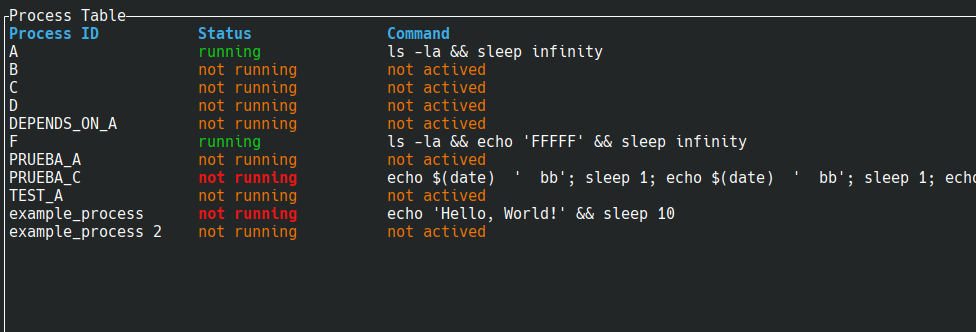

# PROCMAN


## TODO


DOCUMENTAR


¿alguna forma de desbloquear un proceso?
Por ejemplo, un waitting pid file?
quizá desde el tui


move2stop_check_health
no es seguro
si el proceso tarda un tiempo en arrancar y que el health-check diga que está OK
se pondrá como stop, y se volverá a lanzar. REPETIDO


* limpieza 
    * stopped antiguos
    * /tmp/procman no actualizados hace más de varios días
* type -> file_pid   sh -c "echo 'hi' && sleep 2222 &  echo \$! > $PROCMAN_FILE_PID; wait"
* documentar

* muestra en rojo stopped para un proceso one-shot que está "bien" terminado, corregir
* volver a añadir el uid en variable de entorno y verificar al buscar el pid


* tui mostrar la úlitma actualización de procesos, si es muy antigua, en rojo
* delete old files, delete old stopped
* hay que borrar los procesos que tengan running_status pero no estén en config
    * proc_info.process_watched = None
    * en realidad tienen  que estar en stopped hace más de 2h sin que estén en config activos

* configuración tiempo entre rearranques
* errores importantes con "!"
* envío de email para errores importantes?
* fn run_command_with_timeout(command: &str, timeout: time::Duration) -> Result<(), String> {
    * compartir
* ¿añadir un comando force_stop?
* cli 
    * commands
        * stop
        * ...


* probar supervisor
* eliminar los println! y eprintln! centralizar (afecta al tui)
* log con tiempo ejecución oneshot
* tui
    * estructura con estado completo para renderizar
    * filter processes
    * detect if managing/monitoring is stopped
    * show full config for process
    * show depen_on and depend_from processes and navigate to them
* ajustar el tiempo de chequeo
* revisar la visiblidad de módulos pub(crate) pub(super)
* groups?
* add external_depend_cmd
* logs
* commands arguments
    * debug
    * ...
* detect zombie processes
* run-once
* execution retries
    * specify frequency and possibly the number of attempts
* rename running for watched when pertinent
    * running_status
    * RUNNING_STATUS_FOLDER
    * running.status
* tipo daemon


## Description

The goal is to create a simple and secure tool to schedule and manage the startup of multiple services/processes on a machine.

It will work with a text file (currently a TOML configuration) for management.

It is declarative; the system will adjust the service configuration to match the document.

Although it may seem like a supervisor, it has some of the characteristics but intentionally lacks others.

It is not intended to replace mature and high-quality tools like systemd, supervisord, Kubernetes...

It must be a small, lightweight, and non-critical program.

It is not designed to start many services very quickly or work with a cluster.

It will not attempt to start many services simultaneously in parallel, as this could cause bottlenecks in already running services.

If this program stops (due to an error, failure, or intentionally), it should not stop all "managed" services.

Once restarted, it should continue monitoring and managing.

### AIMS

* Start and stop processes
* Declarative and simple  
* No duplicate services  
* Start at the right time  
* The supervision process should not be critical  
* It should not be easy to stop services due to failure or confusion  


## Commands


## Command.gen-file

Esto generará un fichero base sencillo de gestión de procesos

Algo similar a...

```toml
# This is a simple process configuration file for procman
# It contains a single process with a simple command
uid = "fa7c0a0a-dd03-4b99-8068-aae52bb65938"
file-format = "0"

[[process]]
id = "example_process"
apply-on = "2025-05-12T21:00:00"
command = "sleep 5555"

#optionals  -----------------------------------------
fake = false
depends-on = []
work-dir = "/tmp"
before = "echo 'Preparing to start process...'"
init = "echo 'Process is starting...'"
stop = "echo 'Stopping process...'"

[process.schedule]
start-time = "00:00:00"
stop-time = "23:59:00"
week-days = ["mon", "wed", "thu", "sun"]


# ---


[[process]]
id = "example_process 2"
apply-on = "2023-10-01T12:00:00"
command = "echo 'Hello, World!'"
```

Aquí tenemos dos procesos a gestionar


## TUI

Work in progress



The interface is independent from process management and supervision.

The TUI will contrast the information from the configuration file with the information about the running processes.

It will display the status, highlighting differences in red in the Status column.

The TUI can be launched without procman actively monitoring or supervising the processes, what probably will produce inconsistencies

Here an example


As you can see, there are processes in an error state (red color). Some are running when they shouldn’t be, while others are not running despite being expected to be active.

These inconsistencies are detected by comparing the actual state of the processes with the expected by configuration, and are highlighted in the interface.


## Configuración de fichero

El formato de fichero es `toml`

Hay documentación en internet sobre este formato, pero es bastante sencillo y con los ejemplos aquí mostrados no es necesario leer documentación específica de este formato


```toml
uid = "fa7c0a0a-dd03-4b99-8068-aae52bb65938"
```

Cada fichero tiene que tener un uid diferente

Esto se puede generar con el comando `uid`

El comando `gen-file` escribirá un uid válido


```toml
file-format = "0"
```

Indica la versión del formato de fichero


## Configuración básica de proceso

```toml
[[process]]
```

Indicador de inicio configuración de proceso


```toml
id = "example_process"
```


Identificador del proceso

Será utilizada en logs, `tui` y las referencias entre procesos (por ejemplo dependencias de arranque también utilizarán este identificador)


```toml
apply-on = "2023-10-01T12:00:00"
```

Cuando la configuración de este proceso debe empezar a aplicarse

Un `id` puede estar repetido con diferentes `apply-on`


```toml
command = "echo 'Hello, World!'"
```

El comando y parámetros para lanzar el proceso


```toml
depends-on = []
```

Sirve para indicar la lista de procesos de los que dependede

Este proceso no arrancará hasta que los `id` de los procesos indicados no estén en `running`

Los procesos dependientes se detendrán si uno de los procesos de los que depende deja de estar en estado `running`


```toml
work-dir = "/tmp"
```

El comando se lanzará en el directorio indicado


```toml
before = "echo 'Preparing to start process...'"
```

Se ejecutará este comando antes que el comando del proceso

Si el comando falla, no se prosigue, y el reintento comenzará otra vez con `before`


```toml
init = "echo 'Process is starting...'"
```

El proceso ha sio lanzado, está en ejecución, y ahora se ejecutará este comando de inicialización

Si el comando falla, el proceso se detendrá y se reintentará

```toml
stop = "echo 'Stopping process...'"
```

Comando para parar el proceso

Por defecto se enviará un `SIGTERM` y si tras varios reintentos sigue sin detenerse, se enviará un `SIGKILL`


```toml
[process.schedule]
start-time = "00:00:00"
stop-time = "23:59:00"
week-days = ["mon", "wed", "thu", "sun"]
```

Nos permite indicar el horario de ejecución del proceso

Tendrá que estar corriendo en el horario indicado, salvo los `one-shot`


## Examples of service configurations

The configuration will start with an identifier for the services to be managed and the configuration file format.

```toml
uid = "550e8400-e29b-41d4-a716-446655440000"
file_format = "0"
```

The identifier can be generated by passing `uid` as a parameter to the program.

### Example of a process configuration 1

```toml
[[process]]
id = "example_process"
work-dir = "/tmp"
command = "echo 'Hello, World!' && sleep 10"
apply-on = "2024-10-01T12:00:00"

[process.schedule]
start-time = "00:00:00"                  # optional
stop-time = "23:59:00"                   # optional
week-days = ["mon", "wed", "thu", "sun"] # optional
# week_days = "mon-fri"   # also valid
# week_days = "all"   # also valid

[process.init] # optional
command = "sleep 1"
timeout = "3s"  # optional

[process.before] # optional
command = "sleep 1"
timeout = "3s"  # optional

[process.health-check] # optional
command = "sleep 1"
timeout = "3s"  # optional
```

### Example of a process configuration 2

```toml
[[process]]
id = "example_process 2"
command = { line = "echo 'Starting process...'", type = "normal" }
apply-on = "2029-10-01T12:00:00"
init = { command = "sleep 1", timeout = "3s" }
before = { command = "sleep 1", timeout = "3s" }
health-check = { command = "curl -I http://localhost:8080", timeout = "3s" }
schedule = { start_time = "08:00:00", stop_time = "18:00:00", week_days = [
    "mon",
    "tue",
    "wed",
    "thu",
    "fri",
] }
depends-on = ["example_process"]
```


## Parámetros adicionales proceso

```toml
fake = true
```

Indicamos que esta configuración de proceso es falsa y no debe considerarse

```toml
one-shot = true
```

Estos procesos no tienen que estar arrancados permanentemente

Los procesos "normales", en caso de que se paren, se rearrancarán, los `one-shot` no

Estos procesos no pueden seguir la ejecución fuera del horario establecido. Si el proceso sigue en ejecución cuando termina su horario, se inciará el proceso de parada

```toml
init = { command = "sleep 1", timeout = "3s" }
```

This option does not relaunch the process if it stops before its scheduled interval. In fact, the expected behavior is for it to stop earlier.

This is useful for one-time tasks that execute once and terminate when finished. For example, cleanup tasks, log rotation, etc.

Once the process is running, it may be necessary to execute some initialization commands

The process will not be marked as "running" until this command has successfully finished

It will attempt once, and in case of failure, it will transition to the `Stopping` state, initiating the stop procedure.


```toml
before = { command = "sleep 1", timeout = "3s" }
```

Aquí se puede poner un comando a ejecutar antes que el comando de este proceso

Si la ejecución de before tiene éxito, continuará con los pasos para ejecutar este proceso

Si la ejecución de before falla, pasará a stopped y se reintentará más tarde


```toml
stop = "sleep 1"
```

Here you can choose whether to send a specific command to stop the process.

If not specified, a `SIGTERM` will be sent, and if the process does not stop after several retries, a `SIGKILL` will be sent.

You can optionally specify the timeout for executing this command.

```toml
stop = {command = "sleep 5", timeout = "1s"}
```


The safest approach is to work with the `pid`, but in some cases, this may not be possible.

In such cases, the stop command can be used.


## Command

La configuración estándar es...

```toml
command = "sleep 5555"
```

Esto ejecutará el comando con los parámetros seleccionados

Se anotará el `pid` del proceso para vigilar que no se detenga antes de tiempo

En caso de parada, se reiniciará

Si llega la hora de parada y el proceso sigue corriendo, el sistema lo parará con una señal `SIGTERM`, y si tras varios reintentos no se para, se enviará la señal `SIGKILL`


Si queremos que el comando sea una expresión del shell y no sólamente un programa con parámetros, lo indicaremos con...

```toml
command = { line = "echo hi &&  &&  sleep 2  && echo hi2  &&  sleep 555", type = "expression" }
```

> DANGER! Esto puede comprometer la gestión por `pid`del tiempo de vida de los procesos. Ver gestión tiempo de vida de procesos para más detalle


## Change only the command...

If only the command line is changed, the system will not restart the service (this is intentional).

In fact, only when effective apply-on is modified, the process will be restarted

It is not good practice to change only the command line, and restarting the service is a delicate operation.


## Schedule


The process will be running during this start_time / stop_time interval


To define which days of the week it applies

```toml
[process.schedule]
start-time = "00:00:00"                  # optional
stop-time = "23:59:00"                   # optional
week-days = ["mon", "wed", "thu", "sun"] # optional
# week-days = "mon-fri"   # also valid
# week-days = "all"   # also valid
```


### Schedule a future new version

Suppose we want to apply a change to service A for startup tomorrow

```toml
# current version running
[[process]]
id = "SERVICE_A"
command = "echo $(date)  '  bb'"
apply-on = "2023-10-01T08:00:00"

# next version to run
[[process]]
id = "SERVICE_A"
command = "echo $(date)  '  bb'; sleep 1; echo $(date)  '  bb'; sleep 1; echo $(date)  '  bb'; sleep 1"
apply-on = "2025-04-01T08:00:00"
```

We see that the service is defined twice.

One configuration started applying in October 2023.

The next configuration will apply on April 1, 2025, at 8:00 AM.

Since it has no start and stop time, it is a 24x7 service.

On April 1, 2025, at 8:00 AM, the first configuration will stop, and once the stop is confirmed, the second option for `SERVICE_A` will execute.

### Rollback

To perform a rollback, we can mark the new version as `fake`

```toml
# current version running
[[process]]
id = "SERVICE_A"
command = "echo $(date)  '  bb'"
apply-on = "2023-10-01T08:00:00"

# next version to run
[[process]]
fake = true
id = "SERVICE_A"
command = "echo $(date)  '  bb'; sleep 1; echo $(date)  '  bb'; sleep 1; echo $(date)  '  bb'; sleep 1"
apply-on = "2025-04-01T08:00:00"
```


### Dependencies

The process `depends-on_A` will not run until the process `TEST_A` is in the running state.

```toml
[[process]]
id = "TEST_A"
command = "while true; do echo $(date)  '  test a'; sleep 1; done"
apply-on = "2024-11-01T12:20:00"

[[process]]
id = "depends-on_A"
command = "while true; do echo $(date)  '  depends on a'; sleep 1; done"
apply-on = "2024-10-01T12:20:00"
depends-on = ["TEST_A"]
```

Circular references (and self references a a specific case) will be detected on check

Also it will check horphan references


## Gestión de tiempo de vida de los procesos

Por defecto, en comandos sencillos (que son programas con parámetros) se utilizará el `pid` del sistema obtenido al lanzar el proceso para vigilar que este sigue funcionando, o detenerlo cuando sea preciso

En algunos casos, se puede requerir expresiones de `shell`

```toml
command = { line = "echo hi &&   sleep 333 ;  echo  end", type = "expression" }
```

El problema, es que esto puede generar múltiples procesos dependiendo del sistema en ejecución, y la gestión del tiempo de vida y señales, también dependerá del sistema

Adicionalmente `kill -9` en uno de los procesos de una expresión, no será necesariamente propagado a otros procesos

Algunso procesos también pueden lanzar varios procesos, y el proceso objetivo podría no ser el proceso del que se captura el `pid`

Para estas situaciones hay varias opciones

Utilizar una combinación de parámetros

```toml
init = "..."
health-check = "..."
stop = "..."
```

`health-check`  puede recibir un comando con time-out

Se puede verificar si un socket está operativo, o si se ha creado un fichero lock... el comando dependerá del contexto

Opcionalmente a `health-check` se le puede indicar un directorio a vigilar que hay actividad de ficheros

La opción de vigilar un directorio, es muy interesante porque en caso de que el proceso se quede bloqueado, el `pid` seguirá vivo, pero al no haber actividad, el sistema lo reiniciará

> DANGER! Si el proceso tarda mucho en arrancar, y se consulta el `health-check` antes de que esté operativo, el sistema lo dará como no operativo y marcará el proceso como parado. ESTO PODRÍA PROVOCAR ARRANQUES DUPLICADOS

Para evitar arranques duplicados por problemas de concurrencia, en `init` conviene asegurarse de utilizar un comando seguro para parar el proceso/servicio


Existe la posiblidad de utilizar una expresión de `shell` en la que podamos informar a `procman` el pid objetivo a vigilar/gestionar

```toml
command = { line = "echo hi &&  echo $$PROCMAN_PID_FILE$$  &&  sleep 2  && (sleep 333 &  echo  $! > $$PROCMAN_PID_FILE$$)", type = "pid-file" }
```

Se puede utilizar también como variable de entorno

```toml
command = { line = "echo hi &&  echo $$PROCMAN_PID_FILE$$  &&  sleep 2  && (sleep 333 &  echo  $! > $PROCMAN_PID_FILE)", type = "pid-file" }
```

En el momento actual, si se configura un comando con pid-file y este fichero no se genera, este proceso/servicio quedará indefinidamente bloqueado y requerirá una intervención manual para su corrección


### Caso podman

Tenemos la ventaja de que se puede configurar en `before` una parada y borrado del contenedor

```toml
before = "podman stop -t4 test ||  true   &&  podman rm -f test  ||  true"
```

Esto garantiza no ejecutar dos veces dicho contenedor


## Templates

Many services may follow a common pattern.

Repeating it is inconvenient and obscures the configuration.

One option is to create a specific `kind`.

This option is ideal unless you require changes or a new context arises.

In both cases, it would be necessary to recompile and update this program.

Using templates would allow removing redundancies but at the cost of worsening error messages.

Templates should not be overused.

A use case is working with `podman`, as seen in the previous section.

Repeating the following configuration many times makes the configuration file difficult to read:

```toml
command = "podman run --init --rm --name test  docker.io/ubuntu:24.04  sleep 444"
before = "podman stop -t4 test || true && podman rm -f test"
health-check = "[ \"$(podman inspect --format '{{ '{{.State.Status}}' }}' test)\" = \"running\" ]"
stop = "podman stop -t4 test || true && podman rm -f test"
```

A template could be defined as follows:

```toml
[[template]]
name = "PODMAN"
template = '''
command = "podman run --init --rm --name {{ container_name }} {{ image }} {{ command }}"
before = "podman stop -t4 {{ container_name }} || true && podman rm -f {{ container_name }}"
health-check = "[ \"$(podman inspect --format '{{ '{{.State.Status}}' }}' {{ container_name }})\" = \"running\" ]"
stop = "podman stop -t4 {{ container_name }} || true && podman rm -f {{ container_name }}"
'''
```

And the service configuration would be simplified to:


```toml
[[process]]
id = "A"
apply-on = "2029-11-01T12:00:00"

[process.template]
template = "PODMAN"
container_name = "test_a"
image = "docker.io/ubuntu:24.04"
command = "sleep 444"


[[process]]
id = "B"
apply-on = "2029-11-01T12:00:00"

[process.template]
template = "PODMAN"
container_name = "test_b"
image = "docker.io/ubuntu:24.04"
command = "sleep 555"

```

To debug, there is a `cli` command to expand the templates. 

```
expand-templates  Expand config templates and show on stdout
```


## Watched ProcessStatus


----

En revisión


## PODMAN


Working with Podman in this "disconnected" supervision is delicate.

One option to simplify would be to work at the container level instead of the `pid` level.

For this system, one of the priorities is to ensure that services will start when needed.

A running container, in the event of a "sudden" machine shutdown, could end up in a state that poorly responds to startup requests, such as `Created`.

In the `Created` state, it will not respond to `run` or `--replace`, for example.

To ensure the system starts, one option would be to execute:

```txt
podman stop -t4 test || true && podman rm -f test
```

It is also highly recommended to specify that containers must work with ```--init```.

Not working with `pid` would require...

```toml
health-check = "[ \"$(podman inspect --format '{{ '{{.State.Status}}' }}' test)\" = \"running\" ]"
stop = "podman stop -t4 test || true && podman rm -f test"
```

We would end up with something like this...

```toml
command = "podman run --init --rm --name test  docker.io/ubuntu:24.04  sleep 444"
before = "podman stop -t4 test || true && podman rm -f test"
health-check = "[ \"$(podman inspect --format '{{ '{{.State.Status}}' }}' test)\" = \"running\" ]"
stop = "podman stop -t4 test || true && podman rm -f test"
```

This is a very safe configuration for working with a container:


## Running podman detached

Perhaps it is better to use a specific template.

This option may be removed in the future.

Podman can run in `detached` mode and without a `root-daemon`.

This introduces some challenges for supervision.

For this case, there is an option:

`process.command.type = "podman_cid"`

This means it will expect a `podman run -d` (aka podman run detached) which will immediately return the `cid`, and from that `cid` the `pid` will be obtained to supervise the process.

```toml
[[process]]
id = "example_process podman detached"
command = { line: "podman run -d --replace --rm --name test incubator_tini sleep 1122", type = "podman_cid" }
apply-on = "2024-10-01T12:00:00"
```

> **IMPORTANT!**  
> It is highly recommended to always use containers with `--init`


